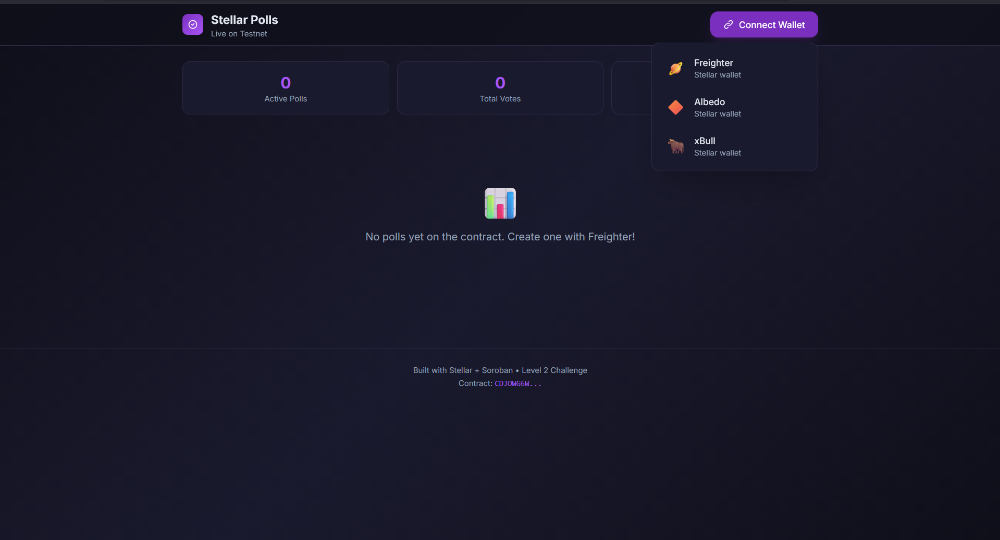

# Stellar Polls - Live Voting on Stellar Testnet

A multi-wallet polling application built on Stellar Soroban smart contracts with real-time event integration.

## Features

- **Multi-wallet support**: Freighter, Albedo, and xBull wallets
- **Create polls** with up to 6 options
- **Live voting** with real-time results
- **Transaction tracking** with pending/success/failed status
- **Event-based updates** via Soroban contract events
- **Error handling**: wallet not found, rejected, insufficient balance

## Tech Stack

- **Frontend**: React 19 + TypeScript + Vite + Tailwind CSS v4
- **Smart Contract**: Rust + Soroban SDK
- **Blockchain**: Stellar Testnet
- **Wallet Integration**: Stellar Wallets Kit

## Prerequisites

- Node.js 18+
- Rust (for contract compilation)
- Stellar CLI (`soroban`)
- A Stellar wallet (Freighter, Albedo, or xBull)

## Setup

### 1. Install Frontend Dependencies

```bash
cd frontend
npm install
```

### 2. Start the Development Server

```bash
npm run dev
```

Open [http://localhost:5173](http://localhost:5173) in your browser.

### 3. Build & Deploy Smart Contract

```bash
# Install Soroban CLI if not already installed
cargo install soroban-cli

# Build the contract
cd contracts/poll
soroban contract build

# Deploy to testnet
soroban contract deploy \
  --wasm target/wasm32-unknown-unknown/release/stellar_poll.wasm \
  --source <YOUR_SECRET_KEY> \
  --rpc-url https://soroban-testnet.stellar.org \
  --network-passphrase "Test SDF Network ; September 2015"
```

### 4. Configure Contract ID

Copy the deployed contract ID and paste it into `src/App.tsx`:

```ts
const CONTRACT_ID = 'YOUR_DEPLOYED_CONTRACT_ID';
```

## Project Structure

```
├── contracts/
│   └── poll/
│       ├── Cargo.toml
│       └── src/
│           ├── lib.rs          # Contract implementation
│           └── tests.rs        # Unit tests
├── frontend/
│   ├── src/
│   │   ├── components/
│   │   │   ├── WalletConnect.tsx   # Wallet connection UI
│   │   │   ├── CreatePoll.tsx      # Poll creation form
│   │   │   ├── PollCard.tsx        # Poll display & voting
│   │   │   ├── TransactionStatus.tsx # Transaction notifications
│   │   │   └── ErrorBanner.tsx     # Error display
│   │   ├── hooks/
│   │   │   └── useWallet.ts        # Wallet connection hook
│   │   ├── utils/
│   │   │   ├── wallet.ts           # Wallet kit configuration
│   │   │   └── contract.ts         # Contract interaction helpers
│   │   ├── types/
│   │   │   └── index.ts            # TypeScript types
│   │   ├── App.tsx                 # Main application
│   │   ├── main.tsx                # Entry point
│   │   └── index.css               # Global styles
│   ├── index.html
│   ├── package.json
│   ├── tsconfig.json
│   └── vite.config.ts
├── scripts/
│   └── deploy.js                   # Deployment script
└── README.md
```

## Smart Contract Functions

| Function | Description |
|----------|-------------|
| `create_poll` | Create a new poll with question and options |
| `vote` | Cast a vote on a poll |
| `get_poll` | Get poll details and results |
| `get_poll_count` | Get total number of polls |
| `has_voted` | Check if an address has voted |
| `get_voter_polls` | Get all polls a voter participated in |

## Events

- `PCREATE` - Emitted when a new poll is created
- `VCAST` - Emitted when a vote is cast

## Error Handling

The app handles three error types:
1. **Wallet Not Found** - When the wallet extension is not installed
2. **Rejected** - When the user rejects the connection request
3. **Insufficient Balance** - When the account lacks funds for a transaction

## Screenshots
 

 
## Submission Info

- **GitHub Repository**: https://github.com/alperendgn14/stellar-level-2-challenge
- **Deployed Contract Address**: `CDJOWG6WXISZO35N7SFCWLNAPLKWK4YVXHVWLRDKA63ZF3CNF2WVYXD2`
- **Transaction Hash**: `1085e36b48c2612ce587ac1f2d53817d8c91e7f8f811399733081406dfd6ed5b`
- **Stellar Expert**: https://stellar.expert/explorer/testnet/contract/CDJOWG6WXISZO35N7SFCWLNAPLKWK4YVXHVWLRDKA63ZF3CNF2WVYXD2
- **Live Demo**: `https://alperendgn14.github.io/stellar-level-2-challenge/`

## License

MIT
